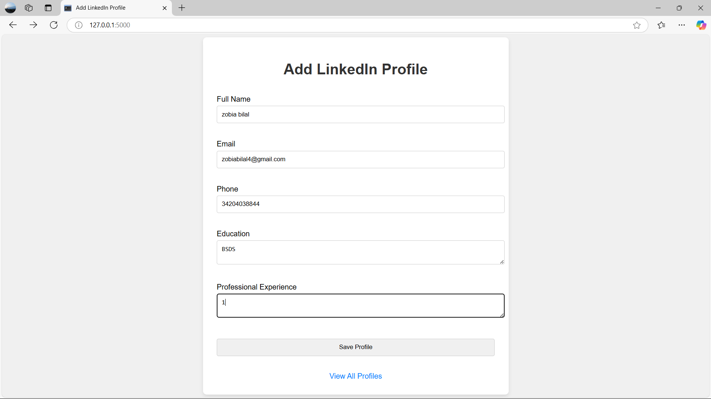
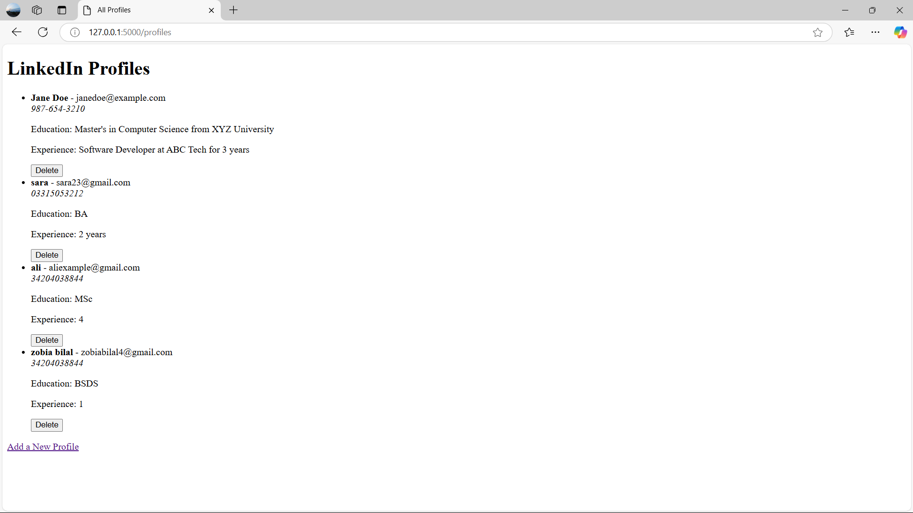

# Big_Data
Here’s a professional and detailed description you can include in your **README.md** file for the project:

---

# LinkedIn Profile Management App

## 📚 Overview  
This project is a **Flask-based web application** that allows users to **store, retrieve, view, and delete LinkedIn profile data**. The application interacts with **MongoDB** to manage the data efficiently and provides a user-friendly interface for managing profile information such as personal details, education, and professional experience.

## 🚀 Features  
- **Add Profile:** Users can input their details, including name, email, phone, education, and experience, using a simple form.
- **View Profiles:** Retrieve and display a list of all stored profiles.
- **Delete Profiles:** Remove any profile from the database with ease.
- **MongoDB Integration:** All data is securely stored in MongoDB Atlas, ensuring scalability and reliability.
- **Responsive Design:** The form is centered with a styled background for a pleasant user experience.

## 🛠️ Technologies Used  
- **Backend:** Flask (Python)  
- **Database:** MongoDB Atlas  
- **Frontend:** HTML, CSS (Bootstrap for styling)  
- **Other Libraries:** Flask-WTF for form handling  

## 📂 Folder Structure  
```
.
├── app.py               # Main application logic
├── templates/           # HTML templates
│   ├── index.html       # Form to add profiles
│   ├── profiles.html    # Displays all profiles
├── README.md            # Project description
└── requirements.txt     # Python dependencies
```

## 🖥️ Getting Started  

### Prerequisites  
1. Python 3.x installed on your system.  
2. A MongoDB Atlas account (or a local MongoDB setup).  

### Installation  
1. Clone the repository:  
   ```bash
   git clone https://github.com/zobiabilal4/Big-Data.git
   cd big-data
   ```
2. Install dependencies:  
   ```bash
   pip install -r requirements.txt
   ```

3. Set up your MongoDB connection:  
   Update the `MongoClient` connection string in `app.py` with your MongoDB Atlas connection string.

4. Run the app:  
   ```bash
   python app.py
   ```
5. Open your browser and navigate to `http://127.0.0.1:5000`.

## 📷 Screenshots  
### Add a LinkedIn Profile  


### View All Profiles  


## 🤝 Contributions  
Contributions are welcome! Feel free to submit a pull request or open an issue to discuss improvements.

